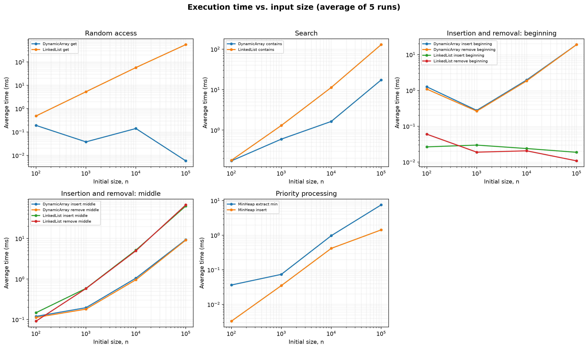
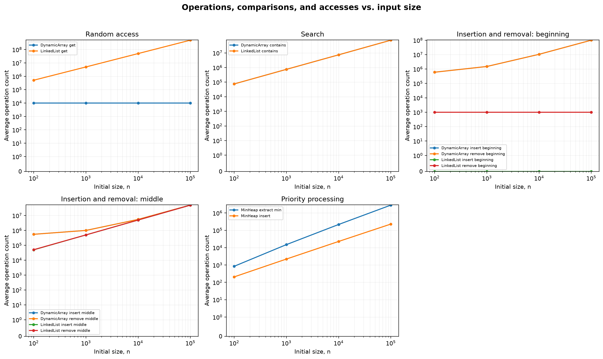

# Assignment 2: Algorithmic Analysis, Correctness and Performance Trade-offs

## 1. Overview

This project implements three integer data structures without using Java collections internally:

- `DynamicArray`: resizable array with indexed access.
- `LinkedList`: singly linked list with head and tail references.
- `MinHeap`: array-based binary min-heap.

`Benchmark` runs the four required workloads and writes the measurements to `results/tables/results.csv`. Java collections are used only in tests as reference implementations.

Requirements: JDK 17+, Maven 3.9+, and Python 3 with Matplotlib. Run all tests with `mvn test`. Run the benchmark with `mvn compile exec:java`, then create the plots with `python plot_results.py`.

## 2. Complexity Analysis

`O` is an upper bound, `Ω` is a lower bound, and `Θ` is a tight bound.

### Dynamic Array

| Operation | Best | Average | Worst | Auxiliary space | Reason |
|---|---:|---:|---:|---:|---|
| `add(x)` | Θ(1) | Θ(1) amortized | Θ(n) | Θ(n) during resize | Append is constant unless the array must be copied. |
| `add(index, x)` | Θ(1) | Θ(n) | Θ(n) | Θ(n) during resize | Elements after `index` are shifted right. |
| `remove(index)` | Θ(1) | Θ(n) | Θ(n) | Θ(1) | Elements after `index` are shifted left. |
| `get(index)` | Θ(1) | Θ(1) | Θ(1) | Θ(1) | The address is calculated directly. |
| `contains(x)` | Θ(1) | Θ(n) | Θ(n) | Θ(1) | Values are checked from left to right. |

### Linked List

| Operation | Best | Average | Worst | Auxiliary space | Reason |
|---|---:|---:|---:|---:|---|
| `add(x)` | Θ(1) | Θ(1) | Θ(1) | Θ(1) | The tail reference gives direct access to the end. |
| `add(index, x)` | Θ(1) | Θ(n) | Θ(n) | Θ(1) | Head/end insertion is direct; a middle position requires traversal. |
| `remove(index)` | Θ(1) | Θ(n) | Θ(n) | Θ(1) | Removing the head is direct; other positions require traversal. |
| `get(index)` | Θ(1) | Θ(n) | Θ(n) | Θ(1) | Nodes are followed from the head. |
| `contains(x)` | Θ(1) | Θ(n) | Θ(n) | Θ(1) | Search stops on a match or at the end. |

### Min-Heap

| Operation | Best | Average | Worst | Auxiliary space | Reason |
|---|---:|---:|---:|---:|---|
| `insert(x)` | Θ(1) | O(log n) | Θ(log n) | Θ(1) | The new value may move from a leaf to the root. |
| `peekMin()` | Θ(1) | Θ(1) | Θ(1) | Θ(1) | The minimum is stored at index 0. |
| `extractMin()` | Θ(1) | Θ(log n) | Θ(log n) | Θ(1) | The replacement root may move down the heap height. |

Operations with the same asymptotic complexity can still have different practical costs. Dynamic Array uses contiguous memory and cache-friendly loops. Linked List follows object references and allocates a node for every value. Middle operations are Θ(n) for both structures, but their constants and memory access patterns differ.

## 3. Correctness

### Loop invariant 1: `DynamicArray.add(index, x)`

The loop shifts the suffix one position to the right.

**Invariant.** At the start of an iteration with loop variable `i`, positions `i + 1` through the old `size` contain the original elements from positions `i` through `size - 1`, and positions `0` through `i - 1` are unchanged.

1. **Initialization.** Initially `i = size`. The shifted range is empty and all original elements are unchanged, so the invariant holds.
2. **Maintenance.** The assignment `elements[i] = elements[i - 1]` moves the next original element right. After `i` decreases, the shifted range has grown by one position and the invariant still holds.
3. **Termination.** The loop stops when `i = index`. Therefore, positions `index + 1` through the old `size` contain the complete original suffix and the prefix is unchanged.
4. **Correctness.** The method writes `x` at `index` and increases `size`. The new array is exactly the old array with `x` inserted at the required position.

### Loop invariant 2: `MinHeap.siftDown` used by `extractMin()`

After the minimum is saved, the last element is moved to the root.

**Invariant.** At the start of every iteration, all heap edges satisfy the min-heap property except possibly the edges from the current `index` to its children. Both child subtrees are valid min-heaps.

1. **Initialization.** Before `siftDown`, only the new root can violate the property. Its left and right subtrees were valid before the last element was moved.
2. **Maintenance.** The loop selects the smaller child. If the current value is larger, they are swapped. The old position becomes valid because the smaller child is no larger than its sibling. The only possible violation moves to the selected child, so the invariant is preserved.
3. **Termination.** The loop stops at a leaf or when the current value is no larger than the smaller child. The current edge is then valid, and the invariant says every other edge is already valid.
4. **Correctness.** The saved root was the minimum. After the loop, the remaining elements satisfy the heap property, so `extractMin()` returns the correct value and leaves a valid min-heap.

## 4. Experimental Setup

- Initial sizes: `n = 100, 1,000, 10,000, 100,000`.
- Random-access workload: `m = 10,000` calls to `get(index)`.
- Search workload: `m = 1,000` calls to `contains(value)`; half are present and half are absent.
- Insertion/removal workload: `m = 1,000` operations at the beginning and at `n / 2`.
- Heap workload: `n` insertions followed by `n` extractions.
- Repetitions: 5; tables report the arithmetic mean.
- Timer: `System.nanoTime()`.
- Random seed: `Random(42)`.
- Input values and operation indices are generated before timing.
- One untimed warm-up is performed before recorded experiments.

The insertion phase adds 1,000 values and the following removal phase removes those values, restoring the original structure. This keeps `m = 1,000` valid even when `n = 100`. Timed regions contain only the required data-structure operations.

Metrics are direct array accesses, linked-node accesses, element movements, or heap comparisons. Setup, validation, CSV writing, and printing are outside the timed regions.

## 5. Results

### Workload 1: Random Access

| n | Dynamic Array time (ms) | Accesses | Linked List time (ms) | Node accesses |
|---:|---:|---:|---:|---:|
| 100 | 0.192 | 10,000 | 0.487 | 511,508 |
| 1,000 | 0.038 | 10,000 | 5.307 | 5,015,208 |
| 10,000 | 0.141 | 10,000 | 57.583 | 50,139,208 |
| 100,000 | 0.006 | 10,000 | 554.861 | 502,499,208 |

Dynamic Array performs exactly one access per request, independent of `n`. Linked List traversal grows linearly with `n`. The very small Dynamic Array times are affected by JVM and timer noise, but its operation count stays constant.

### Workload 2: Search

| n | Dynamic Array time (ms) | Comparisons | Linked List time (ms) | Comparisons |
|---:|---:|---:|---:|---:|
| 100 | 0.174 | 75,572 | 0.180 | 75,572 |
| 1,000 | 0.599 | 752,172 | 1.305 | 752,172 |
| 10,000 | 1.639 | 7,406,172 | 11.337 | 7,406,172 |
| 100,000 | 17.400 | 74,446,172 | 129.787 | 74,446,172 |

Both searches make the same number of comparisons and show Θ(n) growth. Dynamic Array is faster at large sizes because contiguous array traversal has better cache locality.

### Workload 3A: Beginning Insertion and Removal

Each cell shows average time in milliseconds followed by movements or node accesses.

| n | Array insert, Θ(n) | Array remove, Θ(n) | List insert, Θ(1) | List remove, Θ(1) |
|---:|---:|---:|---:|---:|
| 100 | 1.263 / 601,620 | 1.089 / 599,500 | 0.027 / 0 | 0.060 / 1,000 |
| 1,000 | 0.278 / 1,501,780 | 0.264 / 1,499,500 | 0.030 / 0 | 0.019 / 1,000 |
| 10,000 | 1.957 / 10,510,740 | 1.849 / 10,499,500 | 0.024 / 0 | 0.021 / 1,000 |
| 100,000 | 19.074 / 100,500,500 | 19.063 / 100,499,500 | 0.019 / 0 | 0.011 / 1,000 |

Linked List changes only the head references. Dynamic Array must shift the stored elements.

### Workload 3B: Middle Insertion and Removal

| n | Array insert, Θ(n) | Array remove, Θ(n) | List insert, Θ(n) | List remove, Θ(n) |
|---:|---:|---:|---:|---:|
| 100 | 0.120 / 551,620 | 0.113 / 549,500 | 0.148 / 50,000 | 0.091 / 51,000 |
| 1,000 | 0.196 / 1,001,780 | 0.181 / 999,500 | 0.587 / 500,000 | 0.582 / 501,000 |
| 10,000 | 1.052 / 5,510,740 | 0.960 / 5,499,500 | 5.162 / 5,000,000 | 4.982 / 5,001,000 |
| 100,000 | 9.396 / 50,500,500 | 9.148 / 50,499,500 | 63.468 / 50,000,000 | 67.723 / 50,001,000 |

Both structures have linear middle operations. The array is faster for large `n` because shifting contiguous integers is cheaper than following many node references.

### Workload 4: Priority Processing

| n | Insert time (ms) | Insert comparisons, O(n log n) total | Extract time (ms) | Extract comparisons, Θ(n log n) total |
|---:|---:|---:|---:|---:|
| 100 | 0.003 | 207 | 0.036 | 845 |
| 1,000 | 0.035 | 2,207 | 0.074 | 14,988 |
| 10,000 | 0.416 | 22,785 | 0.968 | 216,538 |
| 100,000 | 1.426 | 228,896 | 7.532 | 2,831,900 |

All extracted sequences were verified to be non-decreasing. Extraction comparisons grow near `n log n`. Random insertion used about 2.3 comparisons per item, which is below its `O(log n)` worst-case bound.

## 6. Discussion

1. Increasing `n` barely changes Dynamic Array random access, but it increases Linked List random-access traversal linearly. Search and middle operations also grow approximately linearly. Heap totals grow near `n log n`.
2. Operation counts agree with theory: array `get` remains constant, list `get` grows with `n`, both searches are linear, head operations on Linked List are constant, and heap extraction grows near `n log n`. Random heap insertion stays below its worst-case upper bound.
3. Very short timings do not increase smoothly because timer resolution, JIT compilation, CPU scheduling, cache state, and garbage collection affect measurements. The operation counts show the asymptotic trend more clearly.
4. Algorithms with the same Big-O can have different constants. Dynamic Array search and Linked List search perform equal comparisons, but the array is faster because its values are contiguous in memory.
5. Resizing, node allocation, pointer traversal, bounds checks, cache locality, and branch behavior affect practical time without changing asymptotic complexity.
6. Dynamic Array is preferable for frequent indexed access, compact storage, and append-heavy workloads.
7. Linked List is useful when insertions or removals occur frequently at the head, where no shifting or traversal is required.
8. Min-Heap is appropriate for priority processing because `peekMin()` is Θ(1) and insert/extract are O(log n), unlike repeatedly searching an unsorted collection.
9. The data structure must match the workload: arrays for random access, linked lists for head updates, and heaps for repeated minimum-priority processing.

## 7. Design Recommendations

| Workload | Recommended structure | Reason |
|---|---|---|
| Random indexed access | Dynamic Array | `get(index)` is Θ(1). |
| Sequential search | Dynamic Array | Both are Θ(n), but contiguous memory is faster in practice. |
| Insert/remove at beginning | Linked List | Both operations are Θ(1). |
| Insert/remove in middle | Dynamic Array for this implementation | Both are Θ(n), but array movement was faster than node traversal. |
| Priority processing | Min-Heap | Minimum lookup is Θ(1); updates are O(log n). |

## 8. Conclusion

The experiment shows that asymptotic complexity predicts growth, while memory layout and constant factors explain practical differences. Dynamic Array is best for indexed access, Linked List is best for head changes, and Min-Heap is best when the minimum element must be processed repeatedly.
